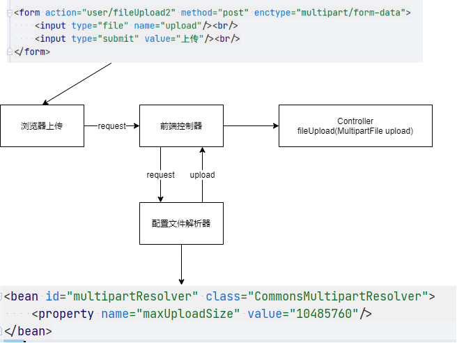

## 文件上传

### 文件上传的必要前提


1. form表单enctype取值必须是`multipart/form-data`
2. form表单method属性取值必须是`Post`
3. 提供一个文件选择域`<input type="file"/>`

### 文件上传的原理

当form表单的enctype的值是`"application/x-www-form-urlencoded"`（默认值）时，表单正文内容是以键值对的形式存在的： 

    key=value&key=value&key=value...

当form表单的enctype的值是`multipart/form-data`时，表单正文内容会变成每一部分都是MIME类型描述的正文

    -------------------xxxxxxxxxxxx
    Content-Disposition: form-data; name="UserName"
    aaaa
    -------------------xxxxxxxxxxxx
    Content-Disposition: form-data; name="file"
    filename = "xxxxxxx/xxxx/xxx/xxx.txt"
    Content-Type: text/plain
    bbbbbbbbbbbbbbbbbbbbbbbbbbbbbbbbbbbbbbbbb
    -------------------xxxxxxxxxxxx--

解析这个内容后实现文件的上传（比较难）

### 借助第三方组件上传文件

因为解析MIME文件比较困难，所以我们用到commons第三方jar包进行这个操作。

在pom依赖中是这个。
```xml
    <dependency>
      <groupId>commons-fileupload</groupId>
      <artifactId>commons-fileupload</artifactId>
      <version>1.3.1</version>
    </dependency>

    <dependency>
      <groupId>commons-io</groupId>
      <artifactId>commons-io</artifactId>
      <version>2.4</version>
    </dependency>
```

### Spring文件上传原理分析

1. 在浏览器中选择文件，上传后文件保存在request中
2. request进入前端控制器
3. 前端控制器调用文件解析器，request进入到文件解析器
4. 解析完毕，返回解析后的上传对象到前端控制器
5. 前端控制器调用Controller类中的方法
6. 利用类MultipartFile绑定上传的文件




其中`<input>`标签内的类型为file的标签，他的name必须是你MultipartFile对象的参数名

### SpringMVC文件上传的方式

SpringMVC框架提供了MultipartFile对象，该对象表示上传的文件，要求变量名称必须和表单file标签的名称属性相同。

1. 配置文件解析器
```xml
<!-- bean的id必须叫这个名字，不能更改 -->
<bean id="multipartResolver" class="CommonsMultipartResolver">
    <property name="maxUploadSize" value="10485760"/>
</bean>
```

2. 获得解析后的文件
```Java
// 获取表单的文件，类型为Spring文件解析器的 MultipartFile，变量名要和表单的name属性一样
String name = upload.getOriginalFilename();
// 获取文件的唯一uuid
String uuid = UUID.randomUUID().toString().replace("-", "");
// 构造新的文件名
String filename = uuid + "_" + name;
// 文件保存，特有方法
upload.transferTo(new File(path, filename));
```

### 跨服务器上传

1. 定义文件上传路径
```Java
String path = "http://localhost:9090/uploads/";
```

2. 导入相应Jar包
```xml
<dependency>
  <groupId>com.sun.jersey</groupId>
  <artifactId>jersey-core</artifactId>
  <version>1.18.1</version>
</dependency>

<dependency>
  <groupId>com.sun.jersey</groupId>
  <artifactId>jersey-client</artifactId>
  <version>1.18.1</version>
</dependency>
```

3. 为页面添加入口

4. 上传文件
```java
// 创建客户端对象
Client client = Client.create();
// 连接服务器
WebResource webResource = client.resource(path + filename);
// 上传文件
webResource.put(upload.getBytes());
```